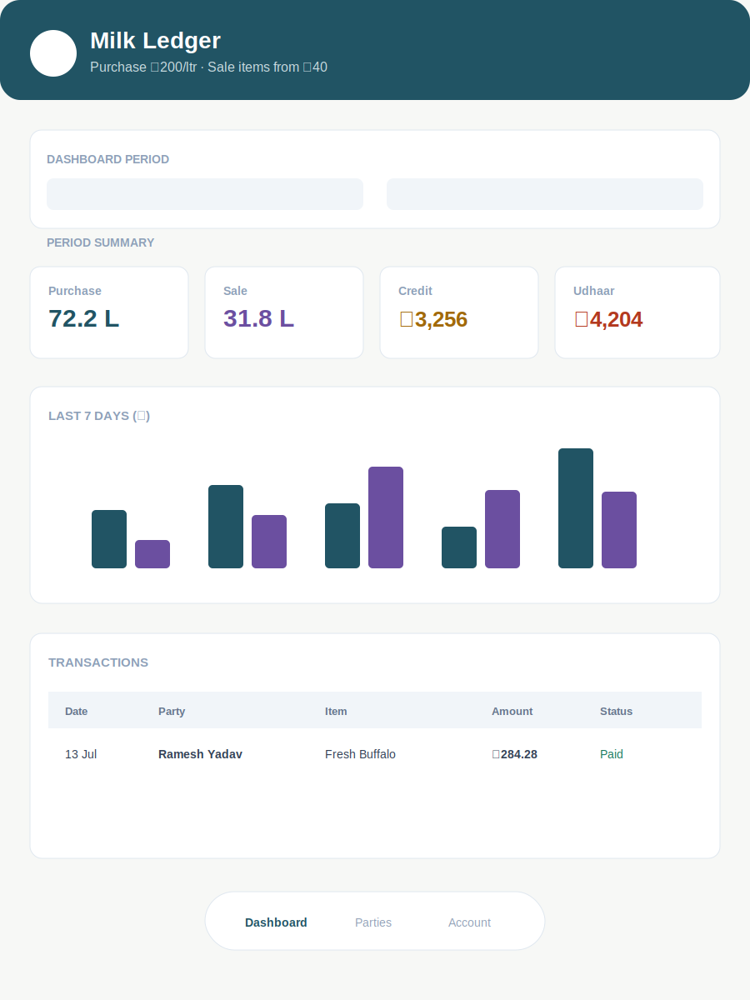
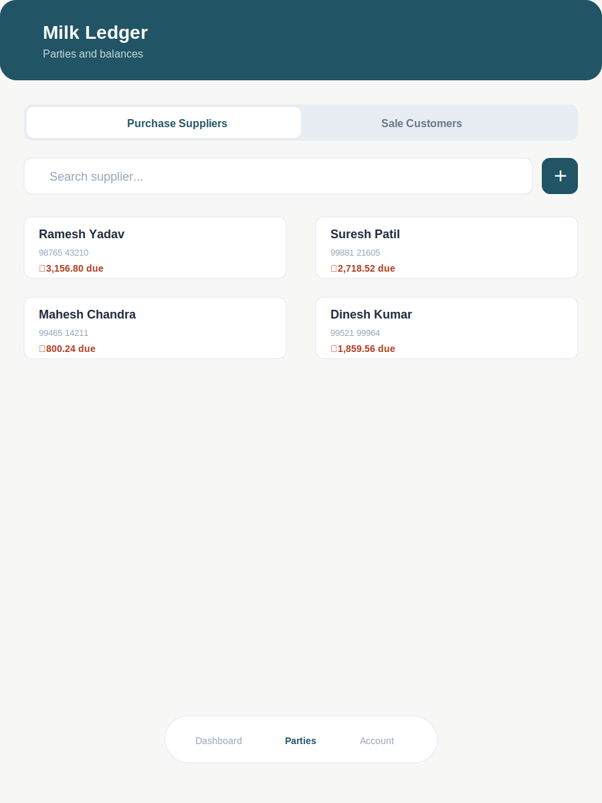
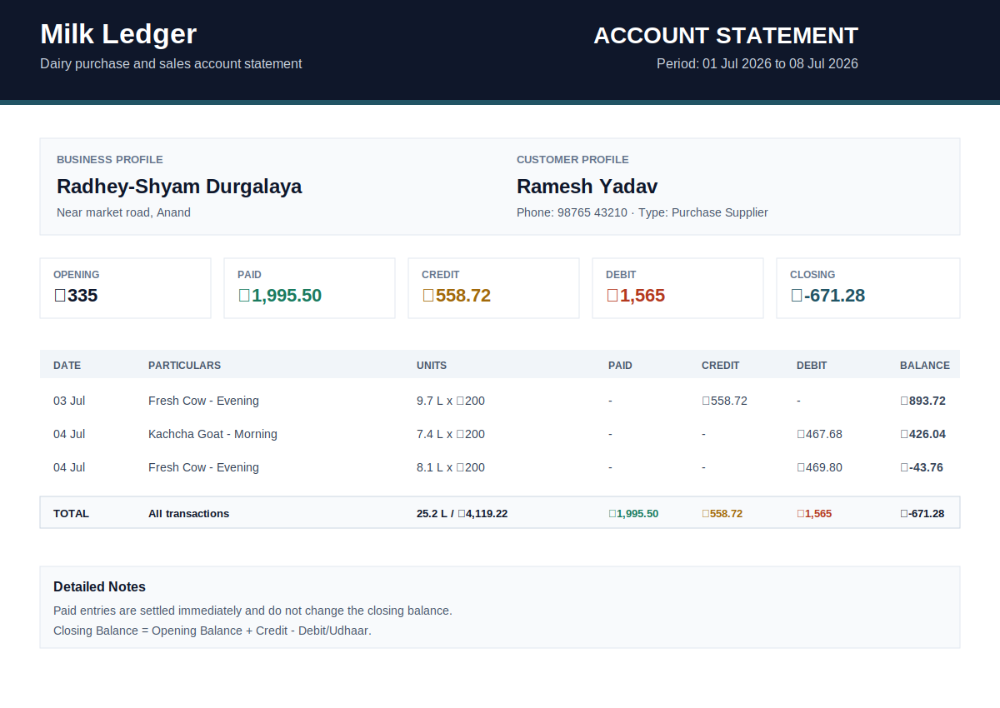
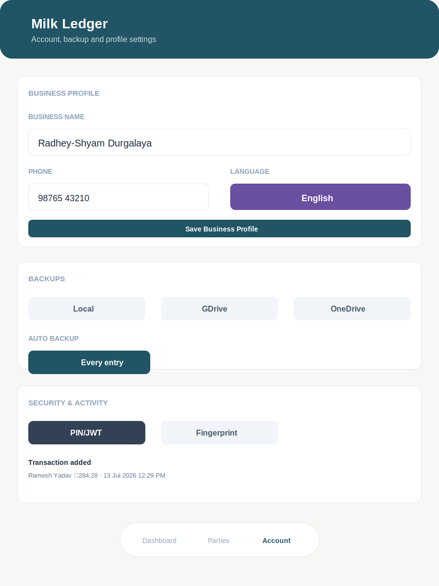

# Milk Ledger Android

Milk Ledger is an offline-first Android dairy ledger for purchase suppliers and sale customers. It tracks milk/item entries, payments, opening balances, rate tables, date-filtered dashboards, account statements, backups, and business profile metadata.

Built with React, Vite, Tailwind CSS, Capacitor, Recharts, jsPDF, and Android native sharing.

## Screenshots

| Dashboard | Parties |
|---|---|
|  |  |

| Statement Export | Account |
|---|---|
|  |  |

## Highlights

- Purchase and sale workflows in one app.
- Supplier/customer profile management with opening balance.
- Milk purchase entries with category, type, shift, quantity, sample weight, and rate.
- Sale entries with item catalog and editable item rates.
- Money transactions for credit/debit adjustments.
- Date-range dashboard filter for period purchase, sale, net, dues, and transaction activity.
- Statement screen with date filters, previous balance carry-forward, totals, running balance, CSV, PDF, image, and text sharing.
- Account tab for business profile, backup export, auto-backup preferences, security preference, language preference, and activity log.
- Offline local storage through a small `window.storage` compatibility layer.
- Android native file sharing through Capacitor Share and Filesystem.

## Statement Calculation

For a date-filtered statement:

- Opening balance is carried forward from the customer opening balance plus all credit/debit activity before the selected `from` date.
- Paid entries are treated as settled immediately and do not change closing balance.
- Closing balance is:

```text
Opening Balance + Total Credit - Total Debit/Udhaar
```

Statement exports include:

- Business profile
- Customer profile
- Date range
- Opening balance
- Paid, credit, debit, and closing summary
- Date, particulars, units, paid, credit, debit, running balance
- Bottom total row across table columns
- Detailed notes

## Project Structure

```text
.
├── android/                  # Capacitor Android project
├── docs/
│   ├── FEATURES.md           # Feature and implementation notes
│   └── screenshots/          # README screenshots
├── src/
│   ├── App.jsx               # App shell
│   ├── MilkLedger.jsx        # Main ledger application
│   ├── index.css             # Tailwind and responsive layout CSS
│   └── storage.js            # localStorage-backed window.storage shim
├── capacitor.config.json
├── package.json
└── vite.config.js
```

## Development

Install dependencies:

```powershell
npm install
```

Run local web development:

```powershell
npm run dev
```

Build web assets:

```powershell
npm run build
```

Sync and build Android debug APK:

```powershell
npm run android:debug
```

The debug APK is generated at:

```text
android/app/build/outputs/apk/debug/app-debug.apk
```

## Android Install

With USB debugging enabled and a device connected:

```powershell
adb install -r -d -g android/app/build/outputs/apk/debug/app-debug.apk
```

Launch:

```powershell
adb shell am start -n com.milkledger.app/.MainActivity
```

## Backup Notes

The Account tab creates a JSON backup containing:

- Business profile
- Account preferences
- Customers
- Transactions
- Rate settings
- Activity log

Google Drive and OneDrive support currently works through the Android share sheet. Choose Drive or OneDrive as the target when sharing the backup file.

## Security And Language Notes

The Account tab stores preferences for:

- `Off`
- `PIN/JWT`
- `Fingerprint`
- `English`
- `Hindi`
- `Gujarati`

These are currently preference settings. Full biometric enforcement, PIN lock screens, and complete translation dictionaries require native auth/localization implementation in a future release.

## Release Status

Current version: `0.2.0`

This is a debug/development build prepared for Android tablet/mobile testing.
